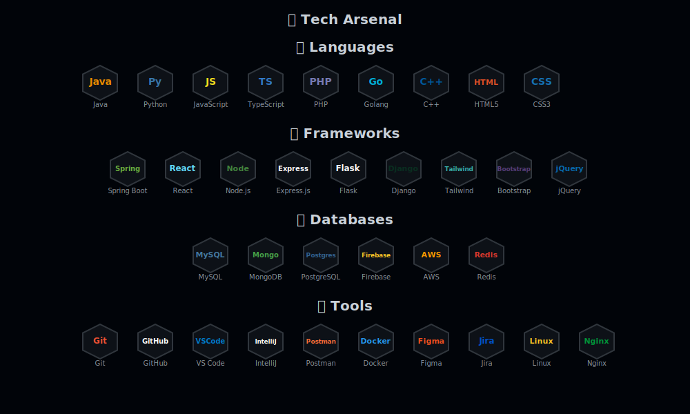

<div align="center">
  
</div>

<div align="center">
  <a href="https://git.io/typing-svg">
    
  </a>
</div>

<div align="center">
  
  [](https://linkedin.com/in/thilina-madhushanka-9ba97625b)
  [](mailto:thilinamadhushanka378@gmail.com)
  [](https://github.com/ThilinaMadhushanka)
  [](https://thilinamadhushanka.github.io/portfolio/)
  
</div>


## 🌌 About Me

```javascript
const thilina = {
    name: "Thilina Madhushanka",
    location: "Rathnapura, Sri Lanka 🇱🇰",
    education: "B.Sc. Computer Engineering",
    currentFocus: "Full-Stack Development & System Design",
    languages: ["Java", "Python", "JavaScript", "C++", "PHP", "Go"],
    interests: ["Web & Mobile Development", "Software Development", "Embedded Systems", "Cloud Computing"],
    hobbies: ["Cricket 🏏", "Gaming 🎮", "Problem Solving 💡"],
    currentlyLearning: ["Advanced React Patterns", "Microservices", "ML/AI"],
    lifePhilosophy: "Build, Break, Learn, Repeat 🔁",
    availability: "Open for internships and collaborations",
    timezone: "Asia/Colombo (GMT+5:30)"
};
```


### 🎯 What I'm Up To

🔭 **Currently Building:** Innovative full-stack applications with modern tech stacks

🌱 **Learning:** Machine Learning, Cloud Architecture & DevOps

👯 **Open to:** Collaborating on impactful open-source projects

💼 **Seeking:** Internship opportunities in software development

💬 **Ask Me About:** Java, React, Spring Boot, REST APIs, DSA

⚡ **Fun Fact:** I turn coffee into code and bugs into features ☕→💻

🎓 **Current Goal:** Contributing to 100+ open source projects

<br clear="right"/>


<div align="center">
  
</div>


## 🐍 Contribution Snake

<div align="center">
  <picture>
    
  </picture>
</div>


## 📈 Profile Views & Visitors

<div align="center">
  
  
  
  [](https://github.com/ThilinaMadhushanka)
  [](https://github.com/ThilinaMadhushanka)
  
</div>


## 🤝 Let's Connect & Collaborate

<div align="center">

I'm always excited to connect with fellow developers, discuss new technologies, or collaborate on innovative projects. Whether you want to talk about code, cricket, or anything in between—feel free to reach out!

**📧 Email:** thilinamadhushanka378@gmail.com  
**💼 LinkedIn:** [Thilina Madhushanka](https://linkedin.com/in/thilina-madhushanka-9ba97625b)  
**🐙 GitHub:** [ThilinaMadhushanka](https://github.com/ThilinaMadhushanka)  
**🌐 Portfolio:** [ThilinaMadhushanka](https://thilinamadhushanka.github.io/portfolio/)

### 💭 Looking For

- 🤝 Collaboration on Open Source Projects
- 💼 Internship Opportunities in Software Development
- 🎓 Mentorship in Advanced System Design
- 🚀 Exciting Full-Stack Development Challenges

### ⭐ Show some love by starring my repositories!

</div>

<div align="center">
  
</div>


<div align="center">
  <i>⚡ "Code is like humor. When you have to explain it, it's bad." – Cory House</i>
</div>
